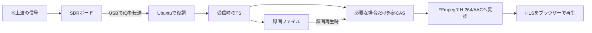

# sdr-dtv-poc

日本の地上デジタル放送をSDRで受信し、ブラウザーで局を探して、視聴・録画する実験的なPoCです。
SDRは、電波をデジタルデータとして取り込み、ソフトウェアで信号を処理する受信機です。
このプロジェクトでは、受信ボードとUbuntu PCを組み合わせてテレビ受信を試します。

**2026-10-04現在、実ボードでのライブ視聴と最大5分の録画・録画再生まで確認しています。**
既存データを使わないCompose/uv環境で、合成デモのスキャンから録画再生まで確認しています。
確認した環境と制限は[導入・動作の検証記録](docs/issue-6-validation.md)を参照してください。
機器を持っていない場合も、下記の合成デモで操作と映像・音声を試せます。

## 対象のハードウェアと環境

| 項目 | 現在の対象 |
|---|---|
| 受信ボード | HLFECのPluto SDR nano互換ボード（Zynq-7010 / AD9363）。確認済みの個体とFWを使用 |
| 受信・処理用PC | Ubuntu 24.04 / x86_64、Docker EngineとDocker Compose。開発時はPython 3.12とuvも使用 |
| 視聴する端末 | UbuntuのChromium系、またはSSH転送で接続するMacのSafari |
| 電波の入力 | 地上波の受信信号。ボードのRX入力に適した接続・入力レベルを事前に確認 |
| スクランブルされた放送の再生 | 対応するカード・カードリーダーと、固定した既存の外部CASツールが別途必要 |

同型という名称だけで、別の互換ボードやFW、純正ADALM-PLUTOでの動作を保証しません。
検証ではボードのFW・FPGA・永続設定を変更していません。受信処理は主にUbuntu側で行います。
検証記録にはFWの詳細バージョンがなく、対応FWの一覧を提示できる段階ではありません。
別の個体ではIIODへ接続できること、必要なRX設定を読めること、復元を照合できることを
実機の手順で確認してください。動作させるために純正機のFWを書き込む手順は含めません。
Macは視聴端末として確認したもので、macOSやWindows上のDocker Desktopを受信ホストにする構成は未検証です。
具体的な準備は[実機の導入・停止手順](docs/live-receiver.md)を参照してください。

## 現在できること

| 機能 | 実装と確認した範囲 |
|---|---|
| 局を探す | UHF 13〜52chを順にスキャンし、検出したサービスと受信設定を保存。中止しても以前の局一覧を保持 |
| ライブ視聴 | 保存した局を選び、受信中にブラウザーで映像・音声を再生。代表の21ch・27chで視聴と切替を確認 |
| 手動録画 | 視聴と同じ受信TSを最大300秒保存。手動停止と自動停止に対応し、録画だけを止めれば視聴は継続 |
| 録画を扱う | 一覧、ブラウザー再生、受信時のTSのダウンロード、利用者による手動削除 |
| 停止・復旧 | 受信停止時に子プロセスを回収し、RX設定の復元を照合。復元を確認できない間は次の受信を止め、WebUIから復旧を進める |
| 機器なしで試す | 自作の合成映像・音声を使ってスキャンから録画再生まで操作。画面だけの模擬デモも用意 |

実機スキャンでは8物理チャンネル・21サービスを保存しましたが、すべてのサービスで視聴を確認したわけではありません。
Chromiumでは映像・非ゼロ音声・再生時刻の進行を機械的に確認し、Safariでの両チャンネルの
視聴・録画再生と、品質修正後の5分録画の再生はユーザーが確認しています。
Safariの詳細バージョンと、最後の5分録画を再生したブラウザー名は記録されていません。
測定値と確認の区別は[実機検証](docs/issue-5-validation.md)、[品質改善の記録](docs/issue-37-validation.md)、
[ブラウザー確認の完了記録](https://github.com/hayatky/sdr-dtv-poc/issues/23)を参照してください。

## 仕組み

ボードで取り込んだ電波のデータ（IQ）をUSBでUbuntuへ送り、研究元の受信処理で
映像・音声を含むデータ列（TS）へ復調します。同じTSを録画と視聴に分けるため、
録画を始めても受信処理を二重に起動しません。



HLSは短い映像ファイルを順に配信する方式で、受信が終わる前から再生できます。
録画には受信時のTSを保持し、再生用の変換結果は別に作ります。
現在のPoCの出力はB階層のTSで、研究元が確認したA/B全階層の多重TSとは区別します。
通常受信ではIQ全量を保存せず、キューと保存量に上限を設けています。

操作と状態管理はFastAPI、局・録画情報の保存はSQLite、画面はVue 3を使います。
復調や変換は子プロセスで動かし、UI・API・HLSは同じオリジンから配信します。
Vueとhls.jsは同梱しているため、Node.js/npmや実行時CDNは不要です。
[API仕様](docs/api.md)と[実機の処理経路](docs/live-receiver.md)に詳しい説明があります。

## 制限と分かっている問題

- **1ボード・同時1物理チャンネル・1利用者・1録画**を対象にしています。受信は1回最大600秒、録画は最大300秒です。
  録画中は選局・スキャン・二重録画を拒否します。
- **長時間のUSB接続の安定性は未解決です。** ケーブルとPCポートを変えた構成では300秒録画に成功しましたが、
  以前の構成で起きた切断の原因は[Issue #38](https://github.com/hayatky/sdr-dtv-poc/issues/38)で調査を続けます。
  切断後は[復旧手順](docs/recovery.md)に従い、設定の復元を確認してから再開します。
- **受信品質と視聴できる局は環境に依存します。** チャンネル別のRXゲイン適用とHLS起動時のキューを修正しましたが、
  全局・全環境での無欠落は保証しません。最終の27ch録画でも、選択サービス以外のPIDにTSの連続性異常が1件あり、
  録画端にはデコード警告が残っています。受信できない局や局名が不明な場合もあります。
- **市販チューナーと同じ使い勝手や互換性を保証するものではありません。**
  再生開始までの待ち時間があり、録画の長さと再生可能な長さは境界の処理等で異なることがあります。
  BS受信、EPG・予約録画、複数チューナー、タイムシフト、字幕・データ放送の完全対応は未実装です。
- **実機用の導入には追加準備が必要です。** 研究元ソースや外部CASは別途取得します。
  合成デモは新しい設定・保存先で導入を確認しましたが、新規OSや実機用の新規構築を確認した結果ではありません。
  研究元wrapperの再配布条件は未確定で、実機用イメージは配布対象に含めません。
  APIの公開先はlocalhostを基本とし、放送映像のインターネット配信は対象にしていません。

## ここまでの開発

研究元の[hlfec-sdr-lab](https://github.com/hayatky/hlfec-sdr-lab)で地上波の復調・TS出力を確認し、
その成果をこのPoCへ接続しました。開発基盤を作り、合成データでWebUI・視聴・録画を実装した後、
実ボードでのスキャンと再生、300秒録画へ進みました。最後に受信ゲインの反映とHLS起動時の
キュー不足を修正し、5分録画の再生まで確認しました（PR #30〜#34、#36、#39）。

## 今後の課題と予定

1. **USB切断の原因調査**：[#38](https://github.com/hayatky/sdr-dtv-poc/issues/38)で
   接続条件と切断原因を切り分け、長時間受信の信頼性を評価します。
2. **受信処理の一部をボード内へ移す研究**：研究元の[#74](https://github.com/hayatky/hlfec-sdr-lab/issues/74)では、
   同期・FFT・等化・判定をFPGAへ移し、ボード内のArm/DDRでデータを保持してUSB転送量を減らす構成を検討します。
   Flashを書き換えずRAMから一時起動する計画で、対象ボードでの動作・復帰や性能はまだ未実証です。
   現行PoCとは別の研究であり、USB切断の解決済み対策ではありません。
3. **CATV経由のBS受信**：研究元のQAM受信の成果を再利用し、このWebUIからBSを視聴・録画できるようにする今後の実装課題です。
   現在のPoCは未対応で、衛星アンテナからの直接受信とは異なります。必要な受信・サービス分離・再生経路を接続し、
   実機で検証します。初期の地上波PoCの完成条件には追加しません。

拡張の順序・時期は未定です。全体の進捗は[Issue #2](https://github.com/hayatky/sdr-dtv-poc/issues/2)で管理します。

## Docker Composeで合成デモを起動

対象はUbuntu 24.04 / x86_64です。Docker EngineとComposeを用意して実行します。
ソースを新しいディレクトリへ取得し、そのディレクトリで以降のコマンドを実行します。

```sh
git clone https://github.com/hayatky/sdr-dtv-poc.git
cd sdr-dtv-poc
```

初回buildはPython依存とFFmpegを取得し、自作の映像・音声から各360秒の連続したTSを2種類生成します。
研究元repo、SDRボード、カード、放送素材、Node.js/npmは不要です。

```sh
docker compose up --build -d --wait
# ブラウザーで http://localhost:8000 を開く
# 使用後は停止する（保存用volumeは保持する）
docker compose down
```

通常の画面は実APIへ接続します。「接続を確認する」→「スキャンを開始する」→
保存された局の「視聴する」の順に操作してください。スキャンの既定対象は合成13・14chです。
映像はテストパターン、音声は440 Hzまたは880 Hzの正弦波で、実機での受信ではありません。
自動再生が拒否された場合は、プレイヤーの再生ボタンを押してください。
録画は最大5分でサーバーが停止します。入力の残量が305秒未満なら開始を拒否するため、
長く視聴した後は受信を停止して選局し直してください。録画だけを停止すると視聴は続きます。

Vue 3.5.22 / hls.js 1.6.13は同梱済みで、実行時CDNやフロントのビルドは不要です。
画面だけの模擬デモは `http://localhost:8000/?mode=mock` で明示的に選べます。
このモードはAPIによる受信・録画とA/V再生を行いません。通信失敗で自動的に切り替わることはありません。
[WebUIの設計](docs/webui-design.md)も参照してください。

公開ポートは127.0.0.1だけです。URLのHost/Originを検証するため、既定では
`localhost`を使ってください。ポートやホスト表記を変える場合は`.env.example`を
参考に`SDR_PORT`と`SDR_ORIGIN`を一致させます。例:

```sh
SDR_PORT=18000 SDR_ORIGIN=http://localhost:18000 docker compose up -d --wait
```

既存の環境と並べて試す場合は、新しいディレクトリに加えて、別のproject名と未使用ポートを使います。
同じproject名を使うと、別ディレクトリでも既存のvolumeやコンテナを共有する場合があります。

```sh
SDR_PORT=18000 SDR_ORIGIN=http://localhost:18000 docker compose -p sdr-demo-trial up --build -d --wait
# 停止時も同じproject名を指定する。保存用volumeは残る
docker compose -p sdr-demo-trial down
```

コンテナはUID/GID 10001の非root、read-only filesystemで実行します。
デバイス・Docker socket・特権モードは使いません。SQLite・オリジナルTS・HLSは`app-data`
volumeへ保存し、アプリで出力量と空き容量を監視します。起動時に自動RXしません。
`docker compose down -v`は保存データを削除するため、通常の停止には使いません。

## uvで開発・起動

Python 3.12、uv 0.12.18を使います。UbuntuでFFmpegを別途導入してください。
uvだけではFFmpeg、GNU Radio、C++の受信ブロックは導入されません。
合成デモにはFFmpeg/ffprobeが必要です。実機用のGNU RadioとC++拡張は
[固定した受信環境の構築手順](docs/receiver.md)で別コンテナへ導入します。
ホストのPythonへ暗黙に混ぜず、[実機用の起動手順](docs/live-receiver.md)から接続します。

```sh
sudo apt-get update
sudo apt-get install ffmpeg=7:6.1.1-3ubuntu5
uv sync --locked
# 次の2行は初回だけ実行する。既存ファイルがある場合は下記の説明を参照する
uv run --locked python scripts/generate-demo.py
uv run --locked python scripts/generate-demo.py --output data/demo/demo-14.ts --channel 14
uv run --locked uvicorn sdr_dtv_poc.app:create_app --factory \
  --host 127.0.0.1 --port 8000 --workers 1 --no-proxy-headers --no-access-log \
  --timeout-graceful-shutdown 10
```

別ターミナルでAPI・TS出力まで確認できます。

```sh
uv run --locked python scripts/smoke-api.py
```

生成スクリプトは、出力先のTSまたは同名のJSONが存在するとエラーで終了します。
生成済みならJSONの`duration_seconds:360`と`physical_channel_label:13/14`を確認し、
生成コマンドを省略して使います。旧8秒デモ等からの再生成は、新しいディレクトリに
13chの`demo.ts`と14chの`demo-14.ts`を作り、`SDR_DEMO_PATH`を新しい`demo.ts`へ変更します。
14chの入力は13chのファイル名の末尾に`-14`を加えたTSとして解決されます。
停止はCtrl+Cです。終了を待ってから再起動してください。APIは必ず単一プロセスで使います。
詳細は[API仕様](docs/api.md)、[受信処理の固定と診断](docs/receiver.md)を参照してください。

既存APIと並行して試す場合は、環境変数`SDR_DATA_DIR`で新しい保存先を指定し、
`SDR_ORIGIN=http://localhost:18001`と起動引数`--port 18001`を一致させます。
合成入力も`SDR_DEMO_PATH`で新しい`demo.ts`を選びます。
実機用の`SDR_LIVE_CONFIG`や`SDR_SAVED_SOURCES`を引き継がない専用ターミナルを使ってください。

## 操作と保存データ

1. 「接続を確認する」で選んだ入力元を確認し、スキャンして局を保存します。
2. 局の「視聴する」で受信を開始します。「録画を開始する（最大5分）」で同じTSを保存し、
   「録画を停止する」で録画だけを止めます。受信を終了する場合は「受信を停止する」を使います。
3. 「録画」タブで完了した録画の「再生する」または「TSファイルをダウンロード」を選びます。
   録画の削除は利用者が明示的に行います。途中で終了した録画は現在のUIでは再生・ダウンロードできません。
4. 使用後は受信・録画を停止し、実機なら復元結果を確認してからサーバーを停止します。
   実機のホスト準備も[停止手順](docs/live-receiver.md)に従って終了します。

Composeの保存先はprojectごとの`app-data` volume、uvの既定は`data/app`です。
局一覧・録画情報のSQLite、受信時のTS、再生用派生物、一時HLSを保存します。
録画TSは再生用変換で上書きせず、ダウンロードも同じTSです。実機でスクランブルされている場合は、
ダウンロードしたTSだけでは通常のプレイヤーで再生できないことがあります。

空き容量は実機の5分録画でも数GBを確保してください。1録画の上限は2 GB、
受信TS出力の上限は4 GB、一時HLSは64 MiB、1件の再生用派生物は640 MiBです。
空き128 MiBを残す検査に加え、録画と派生物の作成に必要な容量を見積もります。
これらはディスク全体の上限ではなく、完了した録画や実機の診断データは蓄積します。
不要なデータの整理前に保存対象を確認し、必要なTSは別の保存先へ退避してください。

## 問題が起きたとき

| 症状 | 確認すること |
|---|---|
| 画面に接続できない | `docker compose ps`、使用ポート、`SDR_ORIGIN`とURLの一致を確認。別端末はlocalhostへのSSH転送を使う |
| 合成デモが使えない | 360秒の13/14ch TSの生成、FFmpeg/ffprobe、保存先への書込みと空き容量を確認 |
| 実機に接続できない・復元を確認できない | 受信を止め、[復旧手順](docs/recovery.md)に従う。DBや復旧記録を消して回避しない |
| 局が見つからない・TSが出ない | 入力元、RXへの配線・入力レベル、TMCC/TSの検出段階を確認。未検出と再生失敗を分ける |
| 録画できるが映像が出ない | カード/CAS、FFmpegの変換、ブラウザーの再生拒否を順に切り分ける。受信TSを保持する |
| 容量不足・途中終了 | 終了理由を確認し、既存TSを保全して容量を確保。途中録画を正常完了として扱わない |

別端末からは例として`ssh -N -L 8000:127.0.0.1:8000 <SSH接続先>`で転送し、
ブラウザーで`http://localhost:8000`を開きます。APIをインターネットへ直接公開しません。
診断ログを相談先へ送る場合も、個人のパス・接続先・識別子・放送素材を除いてください。

## 製品UIを使わずに一連の操作を確認

別担当と保存先・ポート・Compose projectを共有しないでください。専用サーバーで
`uv run --locked python scripts/smoke-stage2.py --origin http://localhost:8000`
を実行すると、合成scan、選局、供給中HLSのA/Vデコード、8秒録画、派生HLSのA/V、
オリジナルのhash一致を確認します。ブラウザー・人による視聴確認とは別です。
この検査は新しいsession・録画を作り、完了データは自動削除しません。

旧8秒デモは5分録画を開始できません。新しい出力先へ360秒のデモを生成し、
`SDR_DEMO_PATH`で選んでください。単純連結や無限ループでは延長しません。

## 開発前の確認

Gitleaks 8.30.1を準備し、既存hookを確認してから本cloneのhookを有効にします。

```sh
git config --local core.hooksPath .githooks
sh scripts/check.sh
```

[開発環境](docs/development.md)、[公開前の検査](docs/sensitive-data.md)、
[Issue #3の検証記録](docs/issue-3-validation.md)、
[段階2の検証・UIへの引継ぎ](docs/issue-4-backend-validation.md)を参照してください。
自動検査はローカルで実行します。記録されている検証結果はローカルでの実行結果です。

研究元の実機成果、PoCの合成デモ、実機での視聴・録画は別の根拠として記録します。
macOS/WindowsのDocker Desktopで受信バックエンドを動かすことは未検証です。
Safariの確認は、Ubuntuで動くバックエンドへSSH転送で接続した結果です。
受信処理の自作wrapper等の配布条件も確認が必要で、既定imageに同梱していません。

## License

Copyright (c) 2026 hayatky

This project's original code is licensed under the GNU General Public License,
version 3 or (at your option) any later version (`GPL-3.0-or-later`). See
[LICENSE](LICENSE). New original sources carry an SPDX identifier.

Third-party components retain their own copyright notices and licenses. See
[THIRD_PARTY_NOTICES](THIRD_PARTY_NOTICES.md) and the [dependency inventory](docs/dependencies.md).
This repository provides source and local build instructions, not container images
or third-party binaries. Before binary/image distribution, provide corresponding
source and build instructions as required by each included component's license.
