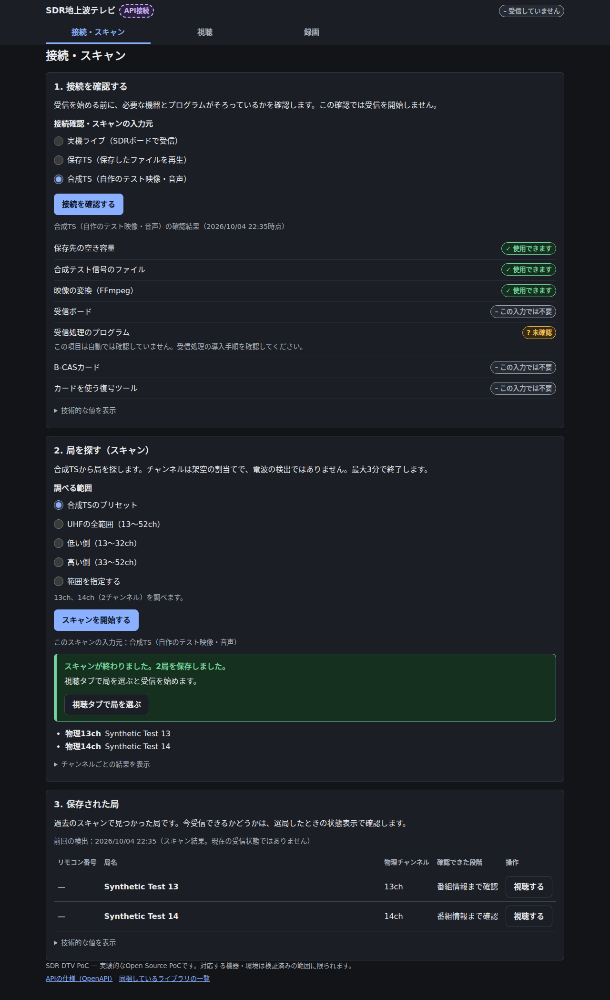
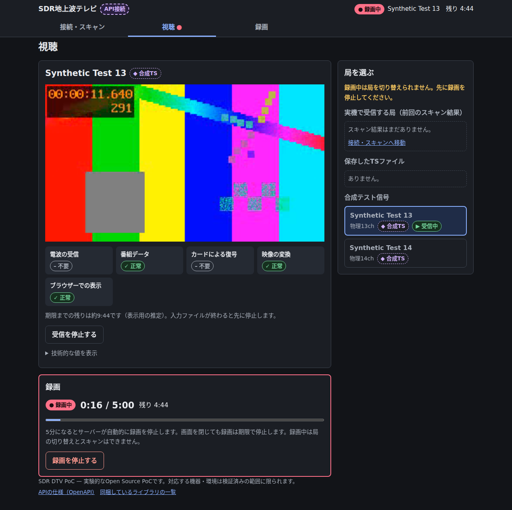
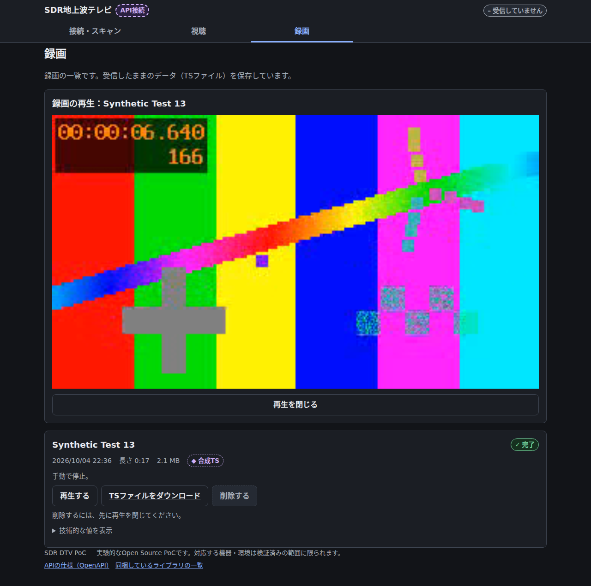

# WebUIの操作ガイド

接続を確認して局を探し、視聴・録画・録画再生へ進む流れを紹介します。
初めて使う場合は、[READMEの導入手順](../README.md#docker-composeで合成デモを起動)から起動してください。
機器なしでも、合成デモでこのガイドの操作を試せます。

画面例はダークモードで撮影しています。WebUIの配色はOS・ブラウザーの設定に従います。
自作の合成映像・音声を実APIで処理した画面で、放送映像や実際の放送局名は使用していません。

## 接続を確認して局を探す

「接続・スキャン」タブで入力元を選び、「接続を確認する」を押します。
保存先の空き容量や、映像の変換に使うプログラムなどを確認できます。この操作では受信を開始しません。

次に、調べる範囲を選んで「スキャンを開始する」を押します。見つかった局は一覧に保存され、
「視聴する」から再生へ進めます。実機ではUHFの範囲を指定できます。
合成デモの13・14chはテスト用の割当で、電波を検出した結果ではありません。

一覧には前回のスキャン結果が残ります。今も受信できるかどうかは、選局後の状態表示で確認してください。
スキャンを中止しても、以前に保存した局の一覧は消えません。

## 視聴しながら録画する

「視聴」タブでは、右側の一覧から局を選べます。映像の下には、電波の受信、番組データ、
カードによる復号、映像の変換、ブラウザーでの表示という各段階の状態が並びます。
再生できない場合は、どの段階で止まっているかを確認できます。合成デモでは受信ボードやカードは不要です。

「録画を開始する」を押すと、視聴と同じTSを保存します。録画中は経過時間と残り時間を表示し、
最大5分で自動停止します。録画中の選局やスキャンはできません。

録画だけを止める場合は「録画を停止する」を押します。視聴はそのまま続きます。
視聴も終える場合は「受信を停止する」を押してください。ブラウザーを閉じるだけでは即時停止しません。
受信自体は1回最大10分で停止します。

## 録画を再生・ダウンロードする

「録画」タブには、録画した局、開始日時、長さ、容量、完了状態が表示されます。
「再生する」を押すと、その録画をブラウザーで再生できます。
「TSファイルをダウンロード」から、保存したTSを手元へ取得できます。

録画は受信時のTSを保持し、ブラウザー再生用のデータは別に作ります。
スクランブルされた実放送のTSは、ダウンロードするだけで一般のプレイヤーで再生できるとは限りません。
保存先と容量については[READMEの保存データの説明](../README.md#操作と保存データ)を、
途中で終了した録画や再生失敗については[復旧手順](recovery.md)を参照してください。
